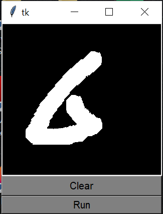
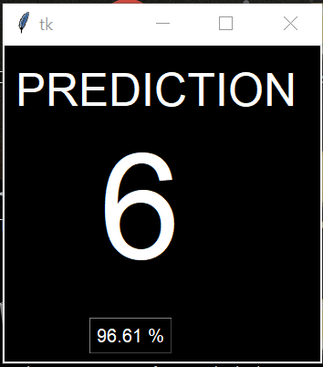

# Real-Time-Digit-Recognition
Using Tkinter and *CONSTITUTIONAL NEURAL NETWORK *

1. The User can Input Any Digit Between (0 to 9) And this model Will Predict and Show The Result.

2. In this I have USED *TKINTER GUI* To Take Data from the User Which  Convertes the Image Pixals into A Numpy Array.

